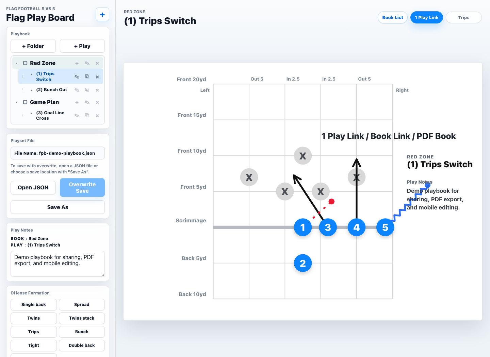
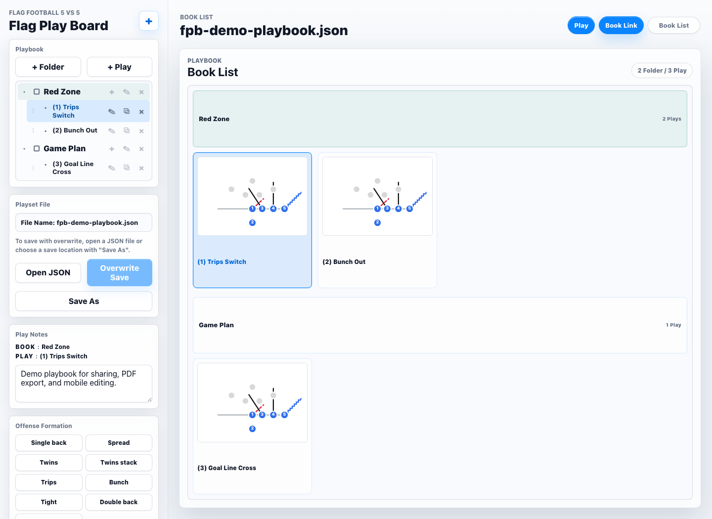
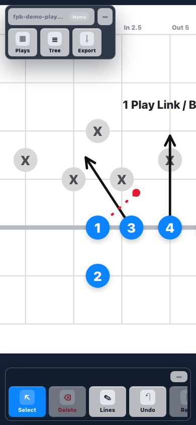

# Flag Play Board 5vs5

An interactive web-based tool for designing and visualizing flag football plays.

[Live Demo](https://samadhi-kz.github.io/fpb/) | [Sponsor this project](https://github.com/sponsors/samadhi-kz)

## Screenshots

| Desktop play editor | Book List overview |
| --- | --- |
|  |  |

| Mobile Full mode |
| --- |
|  |

## Features

- Draw and edit football plays with routes, motions, passes, and blocks
- Switch offense formations in one click: Single back, Spread, Twins, Twins stack, Trips, Bunch, Tight, Double back, and I formation
- Keep fixed offensive roles: 1 Center/Screen, 2 QB, 3 RB/WR / blocker / screen, 4 RB/WR / blocker / screen, 5 RB/WR / blocker / screen
- Show or hide the defense markers while keeping their positions saved
- Customize player markers (light blue circles, red stars, yellow diamonds, green squares)
- Adjust player size and end cap size
- Save and load plays as JSON
- Share plays with links and export plays as PDF
- Manage playbooks with folders and multiple plays
- Responsive canvas for desktop, tablet, and phone use

## Usage

1. Open the application in a web browser
2. Create new plays and organize them into folders
3. Use the drawing tools to add routes and annotations
4. Use Offense Formation to place the offense quickly, then use Flip H for the opposite side
5. Use Defense to show or hide the defensive markers
6. Customize player markers and sizes
7. Save your playbook as JSON for later editing
8. Share plays with links or export PDFs for sharing and printing

Japanese usage notes are available in [docs/usage-ja.md](docs/usage-ja.md).

## Tools

- **Select**: Select and move elements on the field
- **Route**: Draw player routes
- **Motion**: Draw motion routes (zigzag pattern)
- **Pass**: Draw pass routes (dashed)
- **Block**: Draw block assignments
- **Comment**: Add text annotations

## Player Marks

- Light Blue Circle (default)
- Red Star
- Yellow Diamond
- Green Square

## Offensive Roles

- `1`: Center / screen receiver
- `2`: QB
- `3`: RB/WR / blocker / screen
- `4`: RB/WR / blocker / screen
- `5`: RB/WR / blocker / screen

Formation presets follow these roles. `1` stays at center but can be used as a screen receiver, `2` stays behind as QB, and `3`, `4`, `5` are treated as multi-role back/receiver/block-screen players with occasional throw options. Use `Flip H` to mirror the same concept to the other side.

## File Format

Playbooks are saved as JSON and can be easily backed up, shared, or version controlled.

## Formation Presets

- Single back
- Spread
- Twins
- Twins stack
- Trips
- Bunch
- Tight
- Double back
- I formation

The presets are defined for one side of the field. Use `Flip H` to mirror the play.

## Supported Environment

- Local desktop use: open `index.html` directly in a modern browser.
- PC web use: open the GitHub Pages URL in Chrome, Edge, Firefox, or Safari.
- Smartphone web use: open the GitHub Pages URL in iOS Safari or Android Chrome.
- Static hosting only: GitHub Pages or any static file host is enough. No server-side code is required.
- Optional file-system access: direct overwrite works only in browsers that support the File System Access API. Use `Save As` on Safari and other browsers without direct overwrite support.
- Export behavior depends on the browser: links use clipboard/share support, and PDF uses the browser print dialog.

## Testing

No automated test suite is included. The recommended checks are:

1. Run JavaScript syntax checks:

   ```sh
   node --check js/config.js
   node --check js/model.js
   node --check js/playbook-tree.js
   node --check js/drawing.js
   node --check js/field-interactions.js
   node --check js/files.js
   node --check js/playbook-actions.js
   node --check js/main.js
   git diff --check
   ```

2. Open `index.html` locally in a desktop browser and verify:
   - tools switch correctly
   - offense formation buttons move only the offense
   - selecting offensive players shows their role in the Selection panel
   - Defense toggles the defensive markers without deleting them
   - new folder/play creation works
   - routes can be drawn, edited, and cleared
   - JSON export/import works
   - link sharing and PDF export functions open correctly
3. Open the GitHub Pages URL on a desktop browser and verify static hosting works normally.
4. Open the GitHub Pages URL on a smartphone and verify tapping, route creation, the bottom dock, formation buttons, and file export work as expected.
5. Confirm the app remains functional when switching between tools and when using the save/load workflow.

## Usage Scenarios

- Local browser: open `index.html` directly and use the app without a server
- Desktop GitHub Pages: publish the repository and use the app from the hosted URL
- Mobile GitHub Pages: open the hosted URL on a smartphone for touch-friendly editing

## Security Notes

- The app is static HTML/CSS/JavaScript. It has no backend, login, cookies, or remote API calls.
- Scripts are loaded from local project files only.
- Playbook JSON is parsed in the browser and normalized before use.
- User-controlled names, notes, and comments are rendered with text APIs instead of HTML injection.
- File open/save uses browser file dialogs or browser downloads.
- Do not include private or sensitive information in play notes if you plan to share exported JSON, links, or PDF files.

## License

- This project is licensed under the MIT License.
- Copyright (c) 2026 Kazutaka Maeda (@samadhi-kz, @maek0812)
- See [LICENSE](./LICENSE) for details.

## Support

Flag Play Board is free to use. If it helps your coaching, team planning, or flag football workflow, please consider sponsoring the project.

Sponsorship helps keep development going and supports improvements to play sharing, Book links, PDF export, mobile editing, and the overall user experience.

## Contributing

Contributions are welcome! Please feel free to submit issues or pull requests.

Development workflow notes are available in [docs/development.md](docs/development.md).
